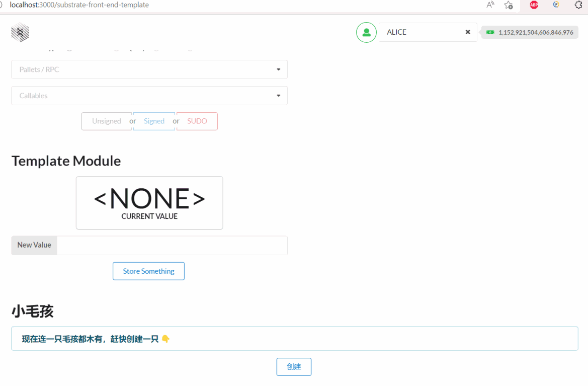

# pallet kitty 第三课作业--rust代码的单元测试和小毛孩的UI
## gif截图如下：


# Substrate Front End Template

This template allows you to create a front-end application that connects to a
[Substrate](https://github.com/paritytech/substrate) node back-end with minimal
configuration. To learn about Substrate itself, visit the
[Substrate Documentation](https://docs.substrate.io).

The template is built with [Create React App](https://github.com/facebook/create-react-app)
and [Polkadot js API](https://polkadot.js.org/docs/api/). Familiarity with these tools
will be helpful, but the template strives to be self-explanatory.

## Using The Template

### Installation

The codebase is installed using [git](https://git-scm.com/) and [yarn](https://yarnpkg.com/). This tutorial assumes you have installed yarn globally prior to installing it within the subdirectories. For the most recent version and how to install yarn, please refer to [Yarn](https://yarnpkg.com/) documentation and installation guides.

```bash
# Clone the repository
git clone https://github.com/substrate-developer-hub/substrate-front-end-template.git
cd substrate-front-end-template
yarn install
```

### Usage

You can start the template in development mode to connect to a locally running node

```bash
yarn start
```

You can also build the app in production mode,

```bash
yarn build
```

and open `build/index.html` in your favorite browser.

### Try the Hosted Version

Connecting to Polkadot:<br/>
https://substrate-developer-hub.github.io/substrate-front-end-template?rpc=wss://rpc.polkadot.io

Connecting to your local Substrate node (Chrome and Firefox only):<br/>
https://substrate-developer-hub.github.io/substrate-front-end-template?rpc=ws://localhost:9944

Connecting to the development Substrate node `wss://dev-node.substrate.dev`:<br/>
https://substrate-developer-hub.github.io/substrate-front-end-template


## Configuration

The template's configuration is stored in the `src/config` directory, with
`common.json` being loaded first, then the environment-specific json file,
and finally environment variables, with precedence.

- `development.json` affects the development environment
- `test.json` affects the test environment, triggered in `yarn test` command.
- `production.json` affects the production environment, triggered in
  `yarn build` command.

Some environment variables are read and integrated in the template `config` object,
including:

- `REACT_APP_PROVIDER_SOCKET` overriding `config[PROVIDER_SOCKET]`

More on [React environment variables](https://create-react-app.dev/docs/adding-custom-environment-variables).

When writing and deploying your own front end, you should configure:

- `PROVIDER_SOCKET` in `src/config/production.json` pointing to your own
  deployed node.

### Specifying Connecting WebSocket

There are two ways to specify it:

- With `PROVIDER_SOCKET` in `{common, development, production}.json`.
- With `rpc=<ws or wss connection>` query parameter after the URL. This overrides the above setting.

## Reusable Components

### useSubstrate Custom Hook

The custom hook `useSubstrate()` provides access to the Polkadot js API and thus the
keyring and the blockchain itself. Specifically it exposes this API.

```js
{
  setCurrentAccount: func(acct) {...}
  state: {
    socket,
    keyring,
    keyringState,
    api,
    apiState,
    currentAccount
  }
}
```

- `socket` - The remote provider socket it is connecting to.
- `keyring` - A keyring of accounts available to the user.
- `keyringState` - One of `"READY"` or `"ERROR"` states. `keyring` is valid
  only when `keyringState === "READY"`.
- `api` - The remote api to the connected node.
- `apiState` - One of `"CONNECTING"`, `"READY"`, or `"ERROR"` states. `api` is valid
  only when `apiState === "READY"`.
- `currentAccount` - The current selected account pair in the application context.
- `setCurrentAccount` - Function to update the `currentAccount` value in the application context.

If you are only interested in reading the `state`, there is a shorthand `useSubstrateState()` just to retrieve the state.

### TxButton Component

The [TxButton](./src/substrate-lib/components/TxButton.js) handles basic [query](https://polkadot.js.org/docs/api/start/api.query) and [transaction](https://polkadot.js.org/docs/api/start/api.tx) requests to the connected node.
You can reuse this component for a wide variety of queries and transactions. See [src/Transfer.js](./src/Transfer.js) for a transaction example and [src/Balances.js](./src/ChainState.js) for a query example.

### Account Selector

The [Account Selector](./src/AccountSelector.js) provides the user with a unified way to
select their account from a keyring. If the Balances module is installed in the runtime,
it also displays the user's token balance. It is included in the template already.

## Miscellaneous

- Polkadot-js API and related crypto libraries depend on [`BigInt`](https://developer.mozilla.org/en-US/docs/Web/JavaScript/Reference/Global_Objects/BigInt) that is only supported by modern browsers. To ensure that react-scripts properly transpile your webapp code, update the `package.json` file:

  ```json
  {
    "browserslist": {
      "production": [
        ">0.2%",
        "not ie <= 99",
        "not android <= 4.4.4",
        "not dead",
        "not op_mini all"
      ]
    }
  }
  ```

  Refer to [this doc page](https://github.com/vacp2p/docs.wakuconnect.dev/blob/develop/content/docs/guides/07_reactjs_relay.md).
